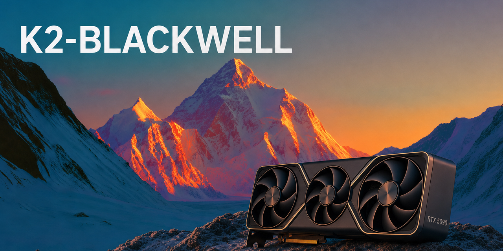

# K2-BLACKWELL

Verified K2 Horizon serving recipes for consumer Blackwell (RTX 5090,
sm120). Every number here was measured on real machines with the exact
commands published next to it. No screenshots without flags, no "trust me"
throughput.

Community project, not affiliated with IFM.

## K2 Horizon links

- Announcement: [ifm.ai/blog/k2](https://ifm.ai/blog/k2) and the get-started page [ifm.ai/k2](https://ifm.ai/k2/#get-started)
- Weights on Hugging Face: [K2-Horizon-0.9B](https://huggingface.co/IFM/K2-Horizon-0.9B),
  [K2-Horizon-3.7B](https://huggingface.co/IFM/K2-Horizon-3.7B),
  [K2-Horizon-7B](https://huggingface.co/IFM/K2-Horizon-7B) / [7B-FP8](https://huggingface.co/IFM/K2-Horizon-7B-FP8),
  [K2-Horizon-32B](https://huggingface.co/IFM/K2-Horizon-32B) / [32B-FP8](https://huggingface.co/IFM/K2-Horizon-32B-FP8),
  [K2-Horizon-MoVA-36B-A4B](https://huggingface.co/IFM/K2-Horizon-MoVA-36B-A4B)
- BF16 GGUFs from IFM: [0.9B](https://huggingface.co/IFM/K2-Horizon-0.9B-GGUF),
  [3.7B](https://huggingface.co/IFM/K2-Horizon-3.7B-GGUF),
  [7B](https://huggingface.co/IFM/K2-Horizon-7B-GGUF),
  [32B](https://huggingface.co/IFM/K2-Horizon-32B-GGUF),
  [MoVA-36B-A4B](https://huggingface.co/IFM/K2-Horizon-MoVA-36B-A4B-GGUF)
- Engines: vLLM support [vllm-project/vllm#55063](https://github.com/vllm-project/vllm/pull/55063) (merged 2026-09-03),
  llama.cpp fork branch [MBZUAI-IFM/llama.cpp `model/K2Horizon`](https://github.com/MBZUAI-IFM/llama.cpp/tree/model/K2Horizon),
  SGLang cookbook [docs.sglang.io/cookbook/autoregressive/IFM/K2-Horizon](https://docs.sglang.io/cookbook/autoregressive/IFM/K2-Horizon),
  vLLM recipe [recipes.vllm.ai/IFM](https://recipes.vllm.ai/IFM)
- Data (listed on the model cards; both returned 401 to anonymous requests on 2026-09-03, so gated or not yet public): [K2-Horizon-Pretrain-Data](https://huggingface.co/datasets/IFM/K2-Horizon-Pretrain-Data),
  [K2-Horizon-Midtrain-Data](https://huggingface.co/datasets/IFM/K2-Horizon-Midtrain-Data)

## Hardware

Current fleet: one box, "saturn": 6x RTX 5090 32 GB (sm120, PCIe, no NVLink),
AMD 5955WX, 125 GB RAM. Recipes state how many of the six cards they use.

## Recipes

Newest first: the top row is always the most recently added or updated
recipe.

| model | engine | hardware | context | decode | prefill | recipe |
|---|---|---|---|---|---|---|
| K2-Horizon-32B (Q8_0 GGUF) | llama.cpp, IFM fork, q8_0 KV | 2x 5090 | 131,072 | 39-42 tok/s | 4,022 tok/s @4K | [recipe](recipes/k2-horizon-32b-gguf/) |
| K2-Horizon-MoVA-36B-A4B (Q8_0 GGUF) | llama.cpp, IFM fork | 2x 5090 | 131,072 | 131-142 tok/s | 6,737 tok/s @4K | [recipe](recipes/k2-horizon-mova-36b-a4b-gguf/) |
| K2-Horizon-7B (BF16 GGUF) | llama.cpp, IFM fork, q8_0 KV | 1x 5090 (2x: 91-94) | 131,072 | 86-91 tok/s | 7,393 tok/s @4K (10,638 on 2x) | [recipe](recipes/k2-horizon-7b-gguf/) |
| K2-Horizon-3.7B | vLLM nightly + K2 files, fp8 KV | 1x 5090 | 131,072 | 147-151 tok/s (563 agg @4) | 18,300 tok/s @3.9K | [recipe](recipes/k2-horizon-3.7b/) |
| K2-Horizon-3.7B (BF16 GGUF) | llama.cpp, IFM fork | 1x 5090 | 131,072 | 140-152 tok/s | 12,366 tok/s @3.9K | [recipe](recipes/k2-horizon-3.7b-gguf/) |
| K2-Horizon-0.9B (BF16 GGUF) | llama.cpp, IFM fork | 1x 5090 | 131,072 | 519-523 tok/s | 32,368 tok/s @4.3K | [recipe](recipes/k2-horizon-0.9b-gguf/) |
| K2-Horizon-MoVA-36B-A4B | vLLM nightly + K2 files + 1 patch, TP=2, fp8 at load, fp8 KV | 2x 5090 | 65,536 | 52-53 tok/s (196 agg @4) | 5,375 tok/s @4K | [recipe](recipes/k2-horizon-mova-36b-a4b/) |
| K2-Horizon-32B-FP8 | vLLM nightly + K2 files, TP=2, fp8 KV | 2x 5090 | 131,072 | 66 tok/s (261 agg @4) | 5,948 tok/s @4K | [recipe](recipes/k2-horizon-32b-fp8/) |
| K2-Horizon-7B-FP8 | vLLM nightly + K2 files, fp8 KV | 1x 5090 | 131,072 | 132-135 tok/s (535 agg @4) | 17,552 tok/s @4K | [recipe](recipes/k2-horizon-7b-fp8/) |
| K2-Horizon-0.9B | vLLM nightly + K2 files, bf16 | 1x 5090 | 131,072 | 447-475 tok/s (1,383 agg @4) | 58,684 tok/s @4K | [recipe](recipes/k2-horizon-0.9b/) |

## Method

Every recipe was benchmarked with `tools/llm-bench` (stdlib only, any
OpenAI-compatible endpoint): a warmup request is discarded, prompts are
seeded so runs are comparable across engines, and prefill is measured with
unique prompts so the prefix cache cannot serve a repeat. Decode is first
token to last token, single stream unless a row says otherwise. Each recipe
also passed the same gates before it was written down: greedy arithmetic,
a generated function that executes, a structured tool call through the
model's own parser, and a needle retrieval at 60K inside a 100K prompt
where the context allows it.

## What we learned on Blackwell

- **vLLM support landed 2026-09-03 08:17Z** (vllm-project/vllm#55063). The
  nightly images built earlier that morning do not have it; the shared
  image in `recipes/vllm-k2-image/` overlays the six merged files on a
  pinned nightly so you can run today.
- **llama.cpp needs IFM's fork** (branch `model/K2Horizon`); mainline has
  no `k2-horizon` architecture yet. `recipes/llamacpp-k2-image/` pins it.
- **The KV cache is dense GQA across the whole fleet.** Per token in bf16:
  56 KB (0.9B), 144 KB (3.7B, 7B), 256 KB (32B), 196 KB (36B MoVA). On a
  32 GB card that makes fp8 KV mandatory for 131K on the 3.7B and 7B under
  vLLM, and puts the 524,288 native context out of reach on two cards for
  the 32B and the 36B.
- **The MoVA 36B runs 2.7x faster on llama.cpp than on vLLM today** (131-142
  vs 52-53 tok/s on the same two cards, and 131K context instead of 65K):
  IFM's fork quantizes the value experts like any other expert tensor,
  while vLLM's merged path keeps them in a bf16-only fused kernel.
- **The MoVA 36B cannot be quantized on stock vLLM.** `--quantization fp8`
  asserts inside the MoVA fused kernel; the recipe carries a one-line
  patch (value experts stay bf16) with the upstream thread and retirement
  condition in its Dockerfile.
- **Sampling sanity, all five models, vLLM (2026-09-04)**: three prompts
  (code, arithmetic word problem, one-paragraph explanation) at vLLM's bare
  default (temperature 1.0, no top-p; the checkpoints ship no sampling
  defaults) and at IFM's recommended 1.0 / 0.95. No garbage on any model in
  either mode: no repetition loops, no stray non-Latin tokens, the train
  problem came out 145 minutes everywhere. What did surface is a parser
  edge case: at high effort the thinking often runs past a 700-token
  budget, and when the output is cut off before `</ifm|think>` closes,
  upstream's `k2_horizon` reasoning parser returns the whole scratchpad as
  `content` with `finish_reason=length`. The shared image now carries a
  one-line fix (unclosed think block = reasoning, content empty); budget
  `max_tokens` generously regardless.
- **Needle at 60K inside 100K**: found by the 7B (vLLM, fp8 KV) and the
  3.7B (llama.cpp, bf16 KV); not found by the 3.7B on vLLM with fp8 KV, by
  the 0.9B on either engine, or by the 32B-FP8. One sample per row; the
  recipes say so.

